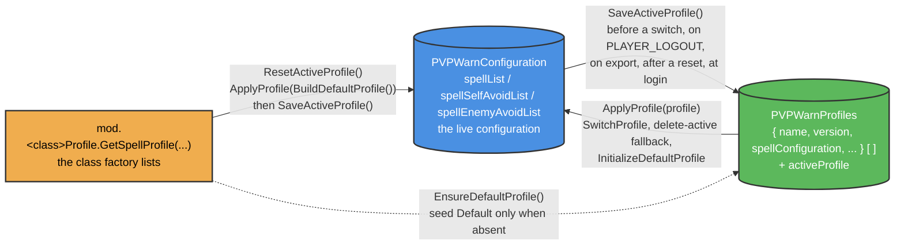
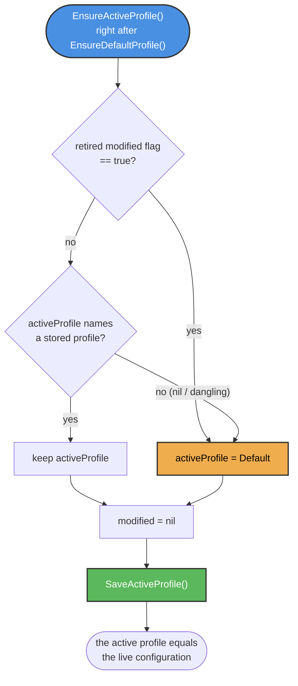
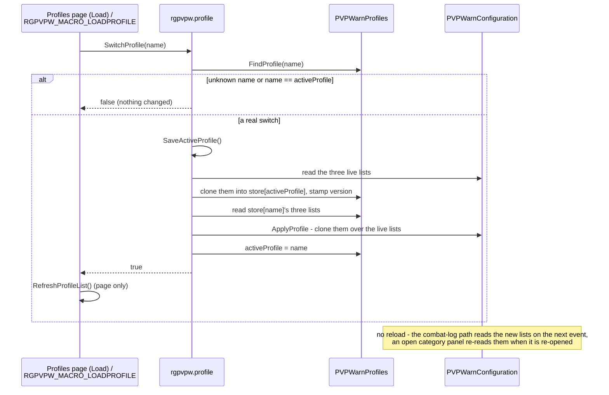

# Profile Flow

These diagrams illustrate how PVPWarn keeps the live spell configuration in an active settings
profile: what a profile captures, when the live lists are mirrored into it, how the active
profile is adopted at login, and how a switch works without a reload. The prose model lives in
[DEVELOPMENT.md](../DEVELOPMENT.md#profiles).

## A - Profile data flow

The two data homes and the three edges between them. `SaveActiveProfile()` is the only writer
of a stored profile from the live state; `ApplyProfile` (a private helper) is the only writer
of the live lists from a stored profile.

## B - Adoption at login

`Core.Initialize` runs `EnsureDefaultProfile()` right after `SetupConfiguration()` and then
`EnsureActiveProfile()`. The login always ends with the active profile equal to the live lists.

The `modified` flag is the snapshot model's "the live lists diverged from the active profile"
marker. A store that carries it as `true` is not claimed by its named profile - the live lists
become Default's and the named profile keeps its own stored copy. The flag is dropped either way
and is never written again.

## C - The no-reload switch

PVPWarn differs from the reloading siblings here: the three lists are plain tables the combat-log
path reads on every event, so a switch takes effect at once. The Profiles page and the macro
bridge share the same path.

## Key Components

### What a profile captures

- Exactly the three per-spell lists, named by `PROFILE_PAYLOAD_FIELDS` in
  `profiles/Profile.lua` and mapped to their live list by `PROFILE_FIELD_TO_SPELL_TYPE`
- `name` and `version` (the running addon version, re-stamped on every mirror)
- Never `activeProfile` - which profile the live lists belong to is not a setting of that
  profile

### The five mirror moments

1. Before a switch (`SwitchProfile`, also `CreateProfile` before it snapshots)
2. On `PLAYER_LOGOUT` (`code/Core.lua`, a gated bus registration)
3. On export (`ExportString`)
4. After a reset (`ResetActiveProfile`)
5. At the end of `EnsureActiveProfile()` at login

### Default

- The editable home profile every character starts on, seeded from the class factory lists by
  `EnsureDefaultProfile()` only when the store has none
- Never deleted, never renamed, never created over; reset through `ResetActiveProfile()`
- `InitializeDefaultProfile()` still wipes and re-seeds - on the fresh-install and the v2.0.0
  upgrade paths only

### Delete-active fallback

`DeleteProfile(name)` of the active profile applies Default's stored copy to the live lists and
makes Default active, with no mirror before (it would resurrect the deleted profile) or after
(Default's stored copy is what was just applied). It returns `true, true` so the page can
refresh.
