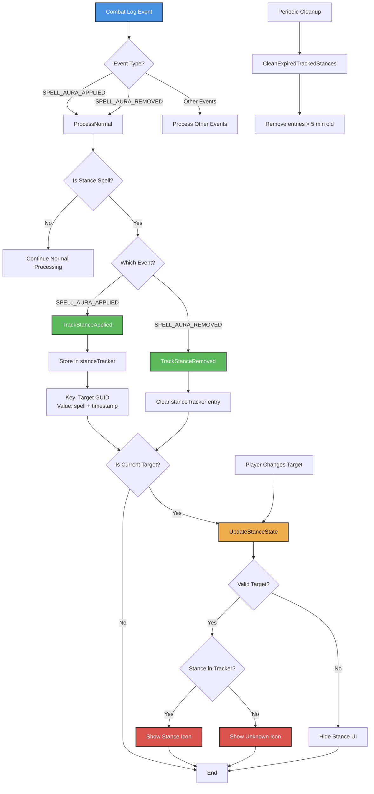

# Stance Tracking Flow

This diagram illustrates how PVPWarn tracks stance states for different classes (Warriors, Druids, Priests, Hunters, and Warlocks).

## Key Components

### Event Processing

- **SPELL_AURA_APPLIED**: Triggered when a stance/form is activated
- **SPELL_AURA_REMOVED**: Triggered when a stance/form is deactivated

### Stance Detection

- Spells with `isStanceSpell = true` are tracked
- Events are filtered in `ProcessNormal` (PVPW_CombatLog.lua:142)

### Class-Specific Behavior

1. **Warriors**:
   - Only track SPELL_AURA_APPLIED events in spell configuration
   - Always in one stance (Battle, Defensive, or Berserker)
   - Switching stances automatically replaces the previous one

2. **Druids**:
   - Track both APPLIED and REMOVED events
   - Can leave forms entirely (shift back to humanoid)
   - Forms: Bear, Dire Bear, Cat, Travel, Aquatic, Moonkin, Tree of Life

3. **Priests**:
   - Track both APPLIED and REMOVED events
   - Shadowform can be cancelled

4. **Hunters**:
   - Track both APPLIED and REMOVED events
   - Aspects: Hawk, Monkey, Pack, Cheetah, Wild, Beast, Falcon, Viper
   - Only one aspect active at a time

5. **Warlocks**:
   - Track both APPLIED and REMOVED events
   - Metamorphosis form (Season of Discovery)
   - Can be cancelled like other transformation abilities

### Important Note
As of the latest update, `TrackStanceRemoved` no longer checks the class category - it uniformly clears the stance tracker entry for any class when a stance is removed.

### Data Storage
- **stanceTracker**: Lua table storing stance data by target GUID
- Each entry contains:
  - `spell`: The spell data object
  - `detectedTime`: Timestamp for cleanup

### UI Updates
- **UpdateStanceState**: Called when:
  - Player changes target
  - Stance change detected for current target
- Shows appropriate stance icon or "unknown" icon

### Cleanup
- Periodic ticker runs `CleanExpiredTrackedStances`
- Removes entries older than 5 minutes
- Prevents memory bloat from accumulated data
