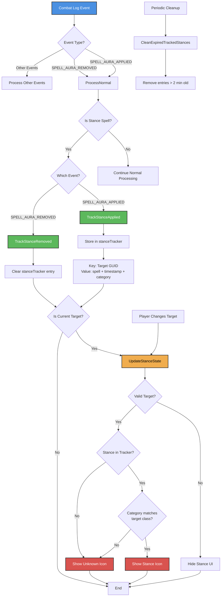

# Stance Tracking Flow

This diagram illustrates how PVPWarn tracks stance states for different classes (Warriors, Druids, Priests, Hunters, and Warlocks).

```mermaid
graph TD
    CombatLogEvent[Combat Log Event] --> EventTypeCheck{Event Type?}

    EventTypeCheck -->|SPELL_AURA_APPLIED| ProcessNormal[ProcessNormal]
    EventTypeCheck -->|SPELL_AURA_REMOVED| ProcessNormal
    EventTypeCheck -->|Other Events| ProcessOther[Process Other Events]

    ProcessNormal --> IsStanceCheck{Is Stance Spell?}
    IsStanceCheck -->|No| ContinueNormal[Continue Normal Processing]
    IsStanceCheck -->|Yes| WhichEventCheck{Which Event?}

    WhichEventCheck -->|SPELL_AURA_APPLIED| TrackApplied[TrackStanceApplied]
    WhichEventCheck -->|SPELL_AURA_REMOVED| TrackRemoved[TrackStanceRemoved]

    TrackApplied --> StoreTracker[Store in stanceTracker]
    StoreTracker --> TrackerData[Key: Target GUID<br/>Value: spell + timestamp + category]

    TrackRemoved --> ClearTracker[Clear stanceTracker entry]

    TrackerData --> CurrentTargetCheck{Is Current Target?}
    ClearTracker --> CurrentTargetCheck

    CurrentTargetCheck -->|Yes| UpdateState[UpdateStanceState]
    CurrentTargetCheck -->|No| End[End]

    UpdateState --> ValidTargetCheck{Valid Target?}
    ValidTargetCheck -->|No| HideUI[Hide Stance UI]
    ValidTargetCheck -->|Yes| StanceInTrackerCheck{Stance in Tracker?}

    StanceInTrackerCheck -->|Yes| CategoryCheck{Category matches<br/>target class?}
    StanceInTrackerCheck -->|No| ShowUnknown[Show Unknown Icon]

    CategoryCheck -->|Yes| ShowStance[Show Stance Icon]
    CategoryCheck -->|No| ShowUnknown

    ShowStance --> End
    ShowUnknown --> End
    HideUI --> End

    PlayerChangesTarget[Player Changes Target] --> UpdateState

    PeriodicCleanup[Periodic Cleanup] --> CleanExpired[CleanExpiredTrackedStances]
    CleanExpired --> RemoveOld[Remove entries > 2 min old]

    style CombatLogEvent fill:#4a90e2,stroke:#333,stroke-width:2px,color:#fff
    style TrackApplied fill:#5cb85c,stroke:#333,stroke-width:2px,color:#fff
    style TrackRemoved fill:#5cb85c,stroke:#333,stroke-width:2px,color:#fff
    style UpdateState fill:#f0ad4e,stroke:#333,stroke-width:2px,color:#000
    style ShowStance fill:#d9534f,stroke:#333,stroke-width:2px,color:#fff
    style ShowUnknown fill:#d9534f,stroke:#333,stroke-width:2px,color:#fff
```

## Key Components

### Event Processing

- **SPELL_AURA_APPLIED**: Triggered when a stance/form is activated
- **SPELL_AURA_REMOVED**: Triggered when a stance/form is deactivated

### Stance Detection

- Spells with `isStanceSpell = true` are tracked
- Events are filtered in `ProcessNormal` in CombatLog.lua
- The flag is set in `code/spellmap/Base.lua` and in the branch overlays `code/spellmap/overlay/Sod.lua` and `code/spellmap/overlay/Tbc.lua`

### Class-Specific Behavior

1. **Warriors**:
   - Only track SPELL_AURA_APPLIED events in spell configuration
   - Always in one stance (Battle, Defensive, or Berserker)
   - Switching stances automatically replaces the previous one
   - Gladiator Stance (Season of Discovery) follows the same APPLIED-only pattern

2. **Druids**:
   - Track both APPLIED and REMOVED events
   - Can leave forms entirely (shift back to humanoid)
   - Forms: Bear, Dire Bear, Cat, Travel, Aquatic, Moonkin
   - Tree of Life (Season of Discovery)

3. **Priests**:
   - Track both APPLIED and REMOVED events
   - Shadowform can be cancelled

4. **Hunters**:
   - Track both APPLIED and REMOVED events
   - Aspects: Monkey, Hawk, Pack, Cheetah, Wild, Beast
   - Falcon and Viper (Season of Discovery), Viper (TBC)
   - Aspects are swapped far more often than any other class swaps stance
   - Aspect of the Pack and Aspect of the Wild are **party wide area auras** - they land on every
     member of the casters party, not only on the caster. The render side therefore compares the
     tracked spells category against the class of the current target and declines to paint a
     mismatch, so a hunter running Aspect of the Pack cannot overwrite the stance icon of the
     warrior next to them

5. **Warlocks**:
   - Track both APPLIED and REMOVED events
   - Metamorphosis form (Season of Discovery)
   - Can be cancelled like other transformation abilities

### Important Note
`TrackStanceRemoved` does not check the class category - it clears the tracker entry for any class, but only when the removal is for the stance that is currently tracked. A stance swap emits a removal for the old stance and an application for the new one in no guaranteed order, so an unconditional clear would wipe the freshly tracked new stance.

### Data Storage
- **stanceTracker**: Lua table storing stance data by target GUID
- Each entry contains:
  - `spell`: The spell data object
  - `detectedTime`: Timestamp for cleanup
  - `category`: The spell map category the stance spell was found in, a lower cased class name.
    Compared against the class of the current target at render time (see Hunters above)

### UI Updates
- **UpdateStanceState**: Called when:
  - Player changes target
  - Stance change detected for current target
- Shows appropriate stance icon or "unknown" icon

### Cleanup
- Periodic ticker runs `CleanExpiredTrackedStances`
- Removes entries older than 2 minutes (`stanceExpiredTimeout` in StanceState.lua)
- Prevents memory bloat from accumulated data
