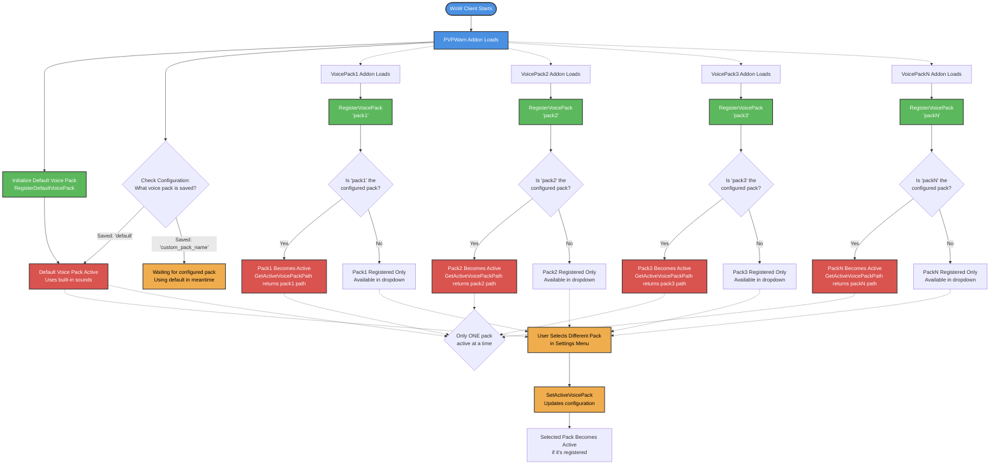

# Voice Pack Loading Flow

This diagram illustrates how PVPWarn handles voice pack registration and activation, showing how multiple voice packs can register while only one can be active at any time.



## Key Components

### Initial Load Sequence

1. **PVPWarn Loads**: When WoW starts, PVPWarn addon initializes
2. **Default Registration**: `RegisterDefaultVoicePack()` is called in `Core.lua`
3. **Default Activation**: Default voice pack is immediately active and available for use
4. **Configuration Check**: System checks saved configuration for previously selected voice pack

### Voice Pack Registration

Each voice pack addon must call `RegisterVoicePack()` when it loads:

```lua
mod.voicePack.RegisterVoicePack(name, displayName, assetPath)
```

- **name**: Internal identifier (e.g., "julie_us")
- **displayName**: User-friendly name shown in dropdown
- **assetPath**: Path to voice pack's sound files

### Registration vs Activation

- **Registered**: Voice pack is available in the dropdown menu
- **Active**: Voice pack is currently being used for sound playback
- Multiple packs can be registered simultaneously
- Only one pack can be active at any time

### Configuration Check on Registration

When a voice pack registers:
1. Pack is added to `registeredVoicePacks` table
2. System checks if this pack matches the saved configuration
3. If it matches, it automatically becomes available for use
4. If not, it's only added to the dropdown options

### User Selection Flow

1. User opens Voice Pack settings menu
2. Dropdown shows all registered voice packs
3. User selects a different pack
4. `SetActiveVoicePack()` updates configuration
5. `GetActiveVoicePackPath()` will now return the new pack's path

### Sound Loading Logic

In `Sound.lua`, the `GetBasePath()` function:
1. Calls `GetActiveVoicePackPath()`
2. If a custom pack is active and registered, returns its path
3. If not (or if "default" is selected), returns built-in sound path

### Fallback Behavior

- If configured pack isn't available: System uses default
- If voice pack fails to register: System continues with current pack
- If invalid pack is selected: System falls back to default
